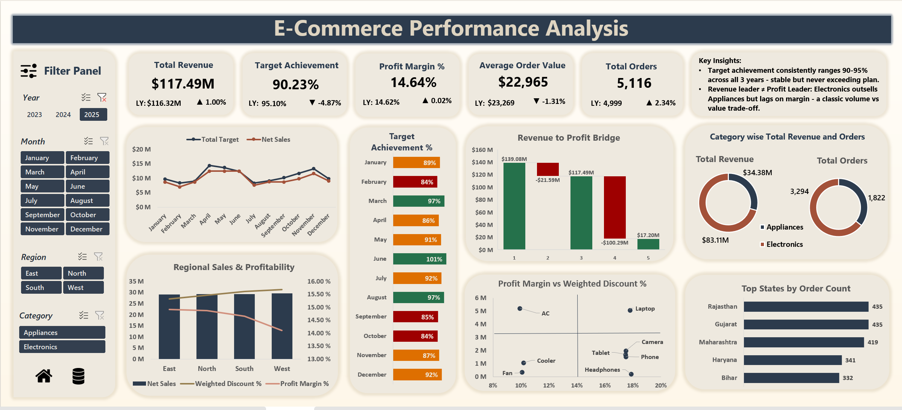
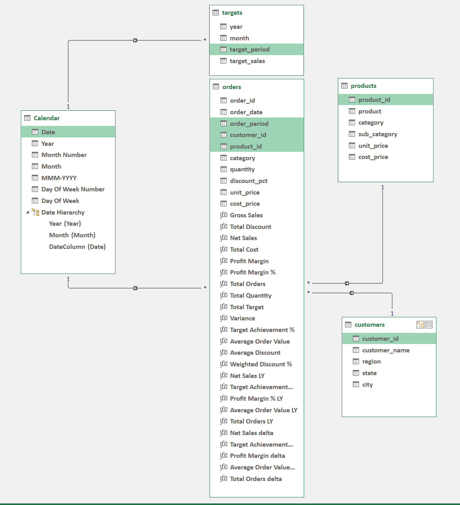
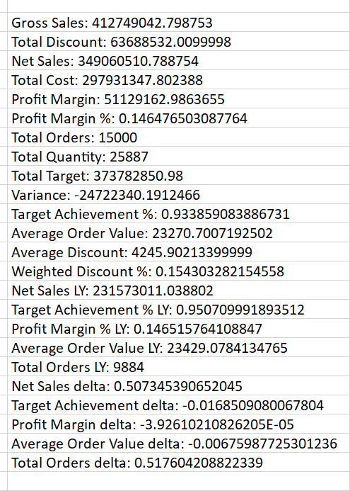
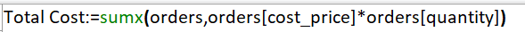

# E-Commerce Performance Analysis | Excel Dashboard
[Download the live dashboard here](Dashboard.xlsx)

**Dashboard Preview**

## Project Overview
This project started from a question I kept running across multiple retail analytics engagements, why do teams always chase revenue but rarely sit down to ask whether that revenue is actually healthy?

I took a raw, multi table e-commerce dataset spanning 3 years (2023-2025), across 2 product categories, 4 regions and 15 states in India and built an end to end analytics solution entirely in Excel - from messy raw tables to a fully interactive, sliceable dashboard. Just Excel used to its full depth.

The result is not just a pretty chart. It's a decision support tool that surfaces the tension between volume and value.

## The Dataset
The raw data came in 4 separate tables - classic star schema territory, but far from clean:
- Orders (15000 Records) (order_id, date, customer_id, product_id, quantity, discount_pct)
- Customers (4000 Records) (customer_id, name, region, state, city)
- Products (200 Records) (product_id, catEgory, sub_category, unit_price, cost_price)
- Targets (36 months) (year, month, target_sales)

## Data Cleaning - What It Actually took
Here's what it genuinely involved:

#### Customers Table
- State names were all over the place - KERALA, KerEla, Gujrat, UP, Uttar Pradesh, all coexisted in the same column. Used PROPER() to fix casing, Find & Replace feature to correct misspellings and a nested IF() to unify UP and Uttar Pradesh into a single consistent label.
- Removed invisible leading/trailing spaces using TRIM() (the kind of issue that silently breaks every VLOOKUP one writes).

#### Products Table
- The sub_category column had formatting nightmares: Ultra---book,  DSLR  , wireless (a mix of extra dashes, inconsistent casing and unnecessary spaces).
- Cleaned using a combination of REPLACE(), TRIM(), Find & Replace feature and nested IF() to standardize labels like Ultrabook, DSLR, Wireless.
- Reformatted unit_price and cost_price columns which had inconsistent decimal handling to proper accounting format.

#### Targets Table
- target_sales column was stored as General, converted to numeric data type before proceeding with any aggregation.

#### Orders Table
- Order dates were stored as Excel serial numbers with extra 0s and # errors. Reformatted to proper date type.

## The Data Model
**Preparation for Data Model**
- Used VLOOKUP() to bring unit_price and cost_pice from the Products table into Orders, needed as base columns for DAX row context calculations.
- Derived order_period using DATE() function (first of each month) with customer number formatting, essential for time series joins in Power Pivot.
- Derived target_period in the Targets sheet using DATEVALUE() with matching custom formatting, so both tables join cleanly with Calendar table on the same period grain.
- Built a Calendar Table using Power Pivot's design feature to enable time intelligence across all slicers
- Constructed a Galaxy Schema connecting all five tables through the data model.

**Schema**

## DAX Measures
All 24 analytical measures live in the Power Pivot data model. Nothing is hardcoded. Every measure recalculates dynamically across any slicer combination.

**DAX List**

Some Key DAX measures worth highlighting - 

**Total Cost**

**Target Achievement**

**Net Sales Last Year**

The delta measures power the ▲/▼ indicators on every KPI card, none of those numbers are typed manually, Change the slicers, everything recalculates.

## Dashboard Features

Built on a single sheet, driven entirely by slicers and pivot charts connected to Power Pivot data model.

**Slicers:** 
- Year (2023-2025)
- Month
- Region (East/North/South/West)
- Category
(all charts respond simultaneously)

KPI Cards: Five headline metrics each paired with LY value and a delta indicator - Revenue, Target Achievement %, Profit Margin %, Average Order Value, Total Orders.

**Charts:**
- Net Sales vs Target (Line) - monthly actuals vs target
- Target Achievement % by Month (Bar, RAG coloured) - below 85% red, 85-95% amber, 95%+ green.
- Regional Sales & Profitability (Combo) - net sales bars with Weighted Discount % and Profit Margin % as overlaid lines
- Revenue to Profit Bridge (Waterfall) - Gross Revenue → Discounts → Net Revenue → Cost → Profit in one view
- Category Revenue & Orders (Dual Donut) - Electronics wins on revenue, appliances closes the gap on margin.
- Profit Margin vs Weighted Discount % (Scatter) - product level view; Laptops and ACs in high profit quadrant, Fans and Coolers in the low return corner
- Top States by Order Count (Bar) 

## Key Findings
 - Revenue is stable. $115 Mn to $116 Mn to $117 Mn across three years. That's not growth, that's flatline with inflation.
 - Electronics is the volume story. Appliances is the profit story. The business is betting on the wrong one. Appliances quietly runs 19.2% margin while Electronics struggles at 12.7%.
 - $64 Mn in discounts. no evidence its working. Weighted average discount with no meaningful correlation to profit contribution across sub-categories. This is not any promotional strategy.
 - Four regions, one problem hiding in the West. Revenue looks balanced until one overlays the discount line. West is spending more to make the same.
 

 ## Excel Features and Techniques Used
 - VLOOKUP() - Enriched Orders table with unit_price and cost_price from Products
 - IF() and nested IF() - State name standardisation, delta measure null-handling
 - PROPER(), TRIM(), Replace feature - Text normalisation across Customers and Products tables
 - DATE() and DATEVALUE() - Period column construction for data model joins
 - Custom Number Formatting - Period Columns, currency display, percentage formatting
 - Power Pivot - Galaxy Schema, table relationships, DAX measure authoring
 - DAX - For interactive calculations
 - Calendar Table - Time Intelligence backbone: auto-generated via Power Pivot design feature
 - Pivot Charts - All dashboard visuals, connected to pivot table sources
 - Slicers - Cross chart filtering via shared data model context
 - Conditional Formatting - RAG colouring on Target Achievement bar chart

 
 ## How to Use
 1. Open [Dashboard File](Dashboard.xlsx)
 2. Enable editing and data connections if prompted.
 3. Navigate to the Dashboard tab.
 4. Use the slicers (Year/Month/Region/Category) to filter all visuals simultaneously.
 5. Refer to the Calculations tab for all pivot table sources.
 6. The Power Pivot data model with all 24 DAX measures is embedded in the workbook, accessible via Data → Manage Data Model
 
*Built entirely in Microsoft Excel with Power Pivot & DAX | Data Span 2023 - 2025 | Indian E-Commerce context*

  **Let's connect and discuss data, dashboard and insights: [Linkedin](https://www.linkedin.com/in/purti1003/)**
 
